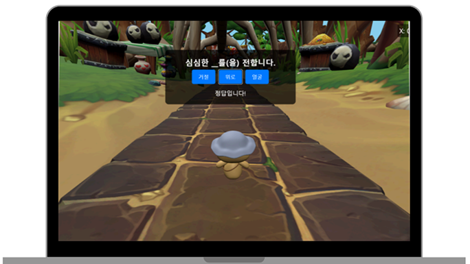
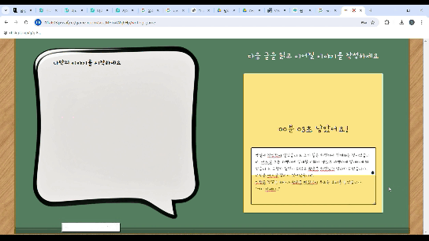

# [문해력 증진 서비스] Lingo-Land  

최근 초등학생들 문해력 이슈로 인해, 이를 해결하고자 하는 서비스

> 2024.07 ~ 2024.08 (6주)

# 기능 소개
## 핵심 기능
1. 국어 문제 맞추기
2. 릴레이 글쓰기

## 세부 기능

### **1. 국어 문제 맞추기**
- **기능 설명**: N명의 사용자가 참여하여, 랜덤으로 제출되는 국어 문제를 맞추며 경쟁합니다. 가장 높은 점수를 획득한 유저가 승리합니다.

### **2. 릴레이 글쓰기**
- **기능 설명**: N명의 사용자가 참여하여, 서로 글을 이어가면서 작성해, 하나의 글을 완성합니다. 완성된 글을 기반으로 동화책을 만들어서 제공합니다.

| **릴레이 글쓰기**                  | **동화 생성**             |
|-----------------------------|--------------------------|
|  |  |

## 아키텍처

## 개선사항

- 유저 실시간 통신 기능으로 Openvidu를 사용했는데, 배포 환경에서 속도가 느려지는 문제
    - 프로젝트 막바지에 알게 되어서, 배포 환경에서의 테스트의 중요성을 깨닫고 다음 프로젝트부터는 인프라를 맡아서 적극적으로 실시하게 됨.
    - websocket으로 변경 필요