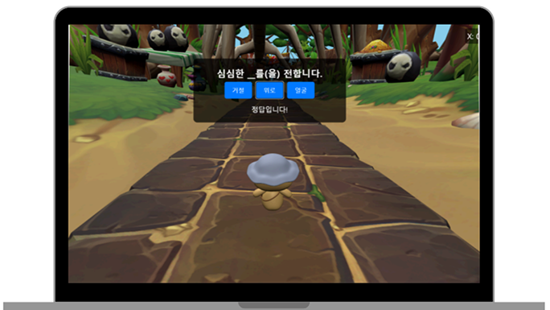
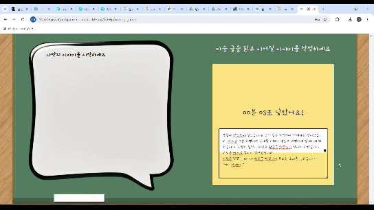

# [문해력 증진 서비스] Lingo-Land  

최근 초등학생들 문해력 이슈로 인해, 이를 해결하고자 기획한 서비스입니다.
학생들이 다 같이 국어 문제를 맞추거나, 릴레이 글쓰기를 통해 동화책을 만드는 기능을 제공합니다.

> 2024.07 ~ 2024.08 (6주)

## [이슈 정리](https://royal-manatee-71e.notion.site/1b8b6f16bdf880eda3eaea0089d34230)

## 기능 소개
### 핵심 기능
1. 국어 문제 맞추기
2. 릴레이 글쓰기

### 세부 기능

#### **1. 국어 문제 맞추기**
- **기능 설명**: N명의 사용자가 참여하여, 랜덤으로 제출되는 국어 문제를 맞추며 경쟁합니다. 가장 높은 점수를 획득한 유저가 승리합니다.

#### **2. 릴레이 글쓰기**
- **기능 설명**: N명의 사용자가 참여하여, 서로 글을 이어가면서 작성해, 하나의 글을 완성합니다. 완성된 글을 기반으로 동화책을 만들어서 제공합니다.

| **릴레이 글쓰기**                  | **동화 생성**             |
|-----------------------------|--------------------------|
|  |  |

## 아키텍처

## 기술 스택

### 프론트 엔드
Vue.js pinia, Node.js
### 백엔드
Java, Spring Boot, Jpa, Spring Security, JWT, Openvidu, Postgresql
### 인프라
EC2, Nginx, Docker, Jenkins
